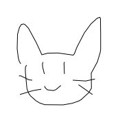
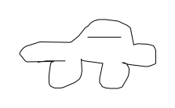
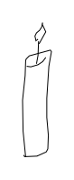
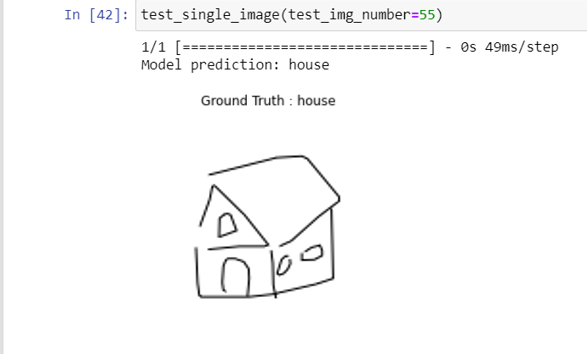

# 🖍️ Problem Statement

We aim to identify hand-drawn sketches, which can include shapes and objects. Users can draw anything (within a limited number of classes) on their device, and our model will detect and identify the drawn object.

Examples of sketches users might provide:

We have to identify what object the user has drawn.

# 🎯 Applications

This project has the following applications:

- **Educational Tool:** Helps children learn about various objects in a fun and - interactive way.
- **Fun Game:** An engaging way for users of all ages to pass the time.
- **Teaching Aid:** Teachers can use this application to conduct drawing tests for children.

# 💡 Proposed Solution

Our approach includes the following steps:

- **Dataset Collection:** We gathered the dataset from Kaggle (Quickdraw Sketches).
- **Model Training:** We trained the model using the collected dataset.
- **Accuracy Enhancement:** We improved the model’s accuracy through various optimizations.
- **Whiteboard Application:** Developed a whiteboard app for users to draw and save their sketches.
- **Image Prediction:** Implemented functionality to allow users to upload an image, which the model then identifies.

Finally, the results are shown.

# ⚠️ Drawbacks

- **Untrained Objects:** If the user draws something the model hasn't been trained on, the prediction may be incorrect.
- **Ambiguous Drawings:** If the drawing is difficult to interpret, the model might also struggle to identify it correctly.

# 🚀 Future Directions

- **Shape Detection:** The application can be extended to detect shapes, allowing for the conversion of hand-drawn flowcharts into digital, editable formats.
- **Difficulty Levels:** Create levels of difficulty, encouraging users to improve their drawing skills.
- **Mobile Application:** Adapt the application for mobile use.
  
## 📚 References

Here is the [link of the dataset](https://www.kaggle.com/datasets/google/tinyquickdraw?resource=download) that we used in this project.
