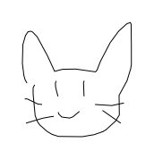
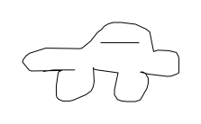
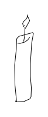
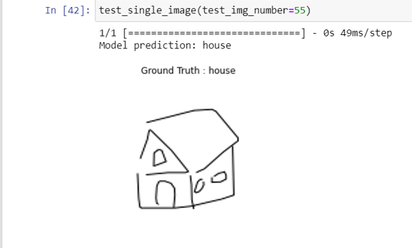

## Problem Statement

To identify hand-drawn sketches. These sketches can be shapes and objects. People can draw anything (limited number of classes) on their device and it will be detected/identified.
User can give us sketches like these:

We have to identify what object the user has drawn.

## Applications
Our Project has following applications:
- This can be used for the learning of children about various objects.
- This can also be seen as a fun game for everyone. This is excellent to eliminate boredom.
- Teachers can use this application to take drawing tests of children.

## Proposed solution
Our proposed solution is given below:
- First we gathered the data set from Kaggle (Quickdraw Sketches)
- Then we trained the model using the dataset.
- Then we enhanced the accuracy of the model by making some changes.
- Then we worked on White-board Application for the users to draw and save their sketches.
- Then we made a function to take the image from device and made the model to predict what is drawn.

Finally, the results are shown.

## Drawbacks
- If the user has drawn something that the model as not seen (not trained upon), the model will still predict but that would be wrong definitely.
- If the user has drawn that is difficult for even the human eye to understand, the model is most likely to make a mistake too.

## Future Directions
- This can also detect shapes, so it can be used to convert hand-drawn flow charts into digital and editable form.
- This application can be used to make levels of difficulty for the users to draw better and better sketches.
- This can be used as a mobile application.

